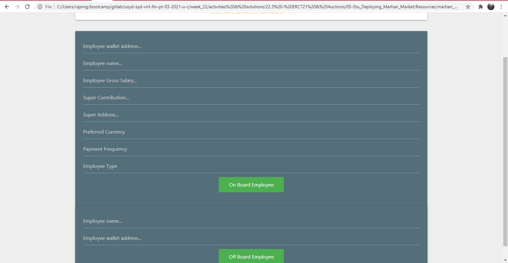

# The Grand Final

As a final project of the FinTech bootcamp, our team has developed a new way of managing your payroll. 
By leveraging Smart Contracts technology you can now easily process your corporate payroll in a fast & secure manner. 
Our team can create a bespoke environment for your company to accommodate for loalized tax schemes, bonus structures, share structures, benefits,... 

# Tools

* [Remix Ethereum](http://remix.ethereum.org/)
* MetaMask
* Ganache _(you can create a test wallet here, get some ethereum in your test wallet [here](https://faucet.ropsten.be/)._

## General information 

In order to get started, ensure you're set up on the test network Kovan. 
If you're looking to export this to your business, please contact us at info@grandfinal.io
Our team of experts will be available to get you started on the Ethereum Mainnet. 

### Step 1 - Onboard your employee

### Step 2 - Create your company Token

### Step 3 - Process payments 

### Possible iterations 
1. Oracle to dynamicly insert other fiat currencies - _currently we only support ETH/USD, of which the value is *not* in real time._
2. 

## Contributing
Thanks to the help of Claudia and Liam for troubleshooting the contract!
