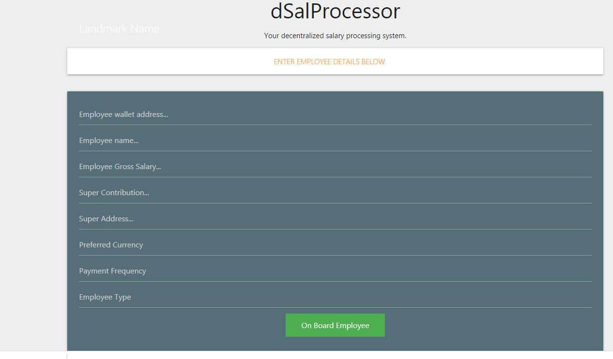
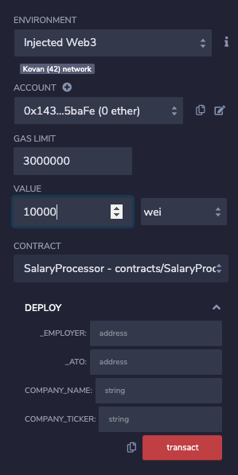
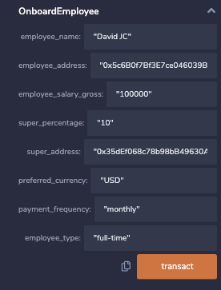
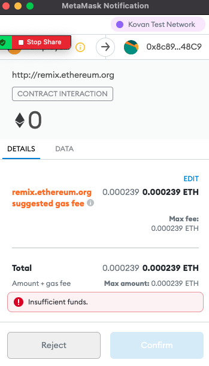

# The Grand Final

As a final project of the FinTech bootcamp, our team has developed a new way of managing your payroll. 
By leveraging Smart Contracts technology you can now easily process your corporate payroll in a fast & secure manner. 
Our team can create a bespoke environment for your company to accommodate for localized tax schemes, bonus structures, share structures, benefits,... 

For this product we've chosen to leverage a Minimum Viable Product, with a number of product improvements mentioned in this document. 
It is our objective to add these features in the near future. 

# Tools

* [Remix Ethereum](http://remix.ethereum.org/)
* MetaMask
* Ganache _(you can create a test wallet here, get some ethereum in your test wallet [here](https://faucet.ropsten.be/)._

## Technical Setup 

In order to get started, ensure you're set up on the test network Kovan. 
If you're looking to export this to your business, please contact us at info@grandfinal.io
Our team of experts will be available to get you started on the Ethereum Mainnet. 

## Business opportunity 

Payment processing is unneccesarily expensive and slow. On top of that as an employee, you're restricted to the a fixed salary package. 
If we can create a compelling offer that resolves many of the current burdens, we're confident to serve a significant portion of this $9 billion market opportunity. 

Through PayRoll you'll have 

* Instant borderless payments
* Secure DeFi payments 
* Flexibility for the employee 
* Salary transparency (optional)
* Lower payroll costs

### Step 1 - Onboard your employee(s)

As a first step you need to onboard your employee(s) & their personalized information through the onboarding process. 
The process can be customized, for now it includes basic inputs such as: wallet address, super address, ato address,... 

The screengrab below shows how the JavaScript page will render which again can be customized to suit your corporate environment. 

_Product improvement: implement a csv bulk upload feature to accomodate for larger companies_ 

_Please note the functionality of the JavaScript website is not yet connected to our Smart Contract, this needs to be developed further_ 

### Step 2 - Enter your corporate details & create your company Token

In the next step your company will add their corporate details such as the employer wallet and ATO address.
In addition, the compnay name and company ticker are created with an initial supply of 0. 

These tokens are the equivalent of company shares. At this point no action is required however it creates plenty of possibiilites for the future. 
Think about giving your employees a stake of your company or even paying their salaries in your Company Token. Another possibility is to offer investors to buy themselves in to your company. The sky is the limit. 

In order to run this you need to access [Remix Ethereum](http://remix.ethereum.org/) with a compiler of > 0.6.7. 
Don't forget to add a minimum of 10,000 wei to pay for the Gas fee when runninng a test. 

### Step 3 (temporary step) - Onboard employee data 

In the next step, we'll manually onboard an employee to test the functionality and process a salary payment. 
This step won't be necessary once the JavaScript in step #1 is resolved. 
On the other hand, it is an excellent feature to process one off payments 

### Step 4 - Pay Salary ! 

In the final step, the salary will be paid! You can add the payment via the contract upon which MetaMask will trigger and process the payment. 

_Project note, unfortunately we had limited Faucet Tokens however below is a screengrab to display the MetaMask payment prior to it going through._ 

_Product improvement - the contract should still be automated by letting the contract run on a daily basis. This would be done through Python_ 

## Group presentation 

Our presentation can be found through this [link](https://docs.google.com/presentation/d/1pkGtXf4Ycx3PfIZa1DaqCv7liGBZAai46s1rgbe8NMY/edit#slide=id.p)

## Contributing
Thanks to the help of Claudia and Liam for troubleshooting the contract!
